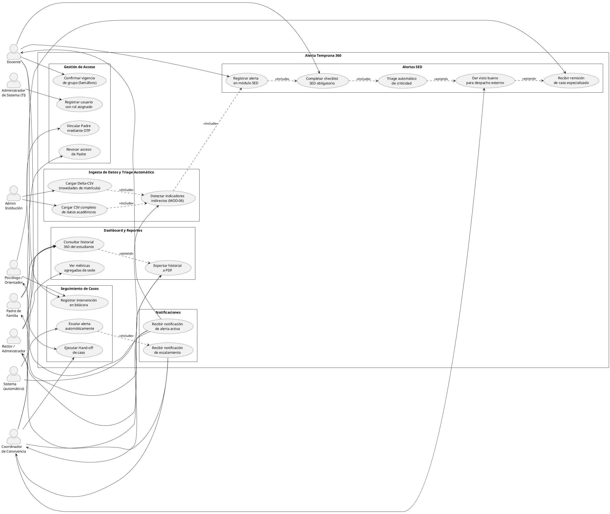
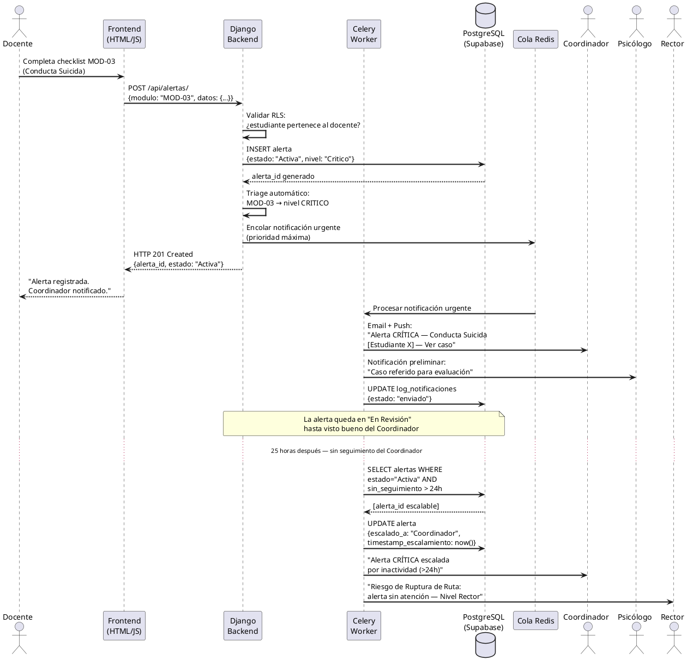
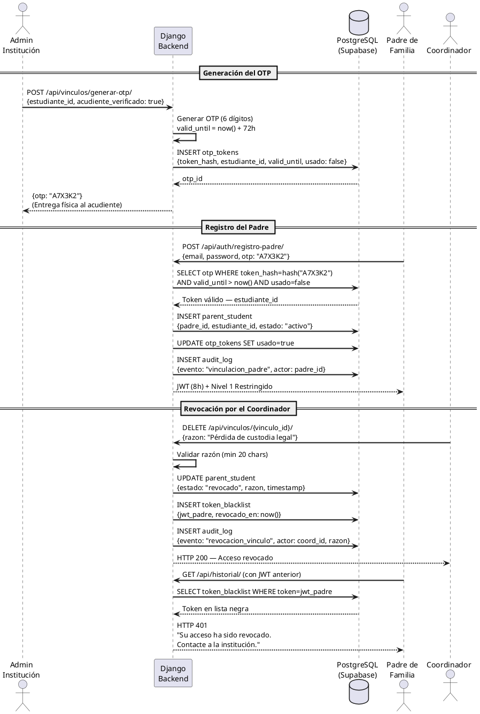
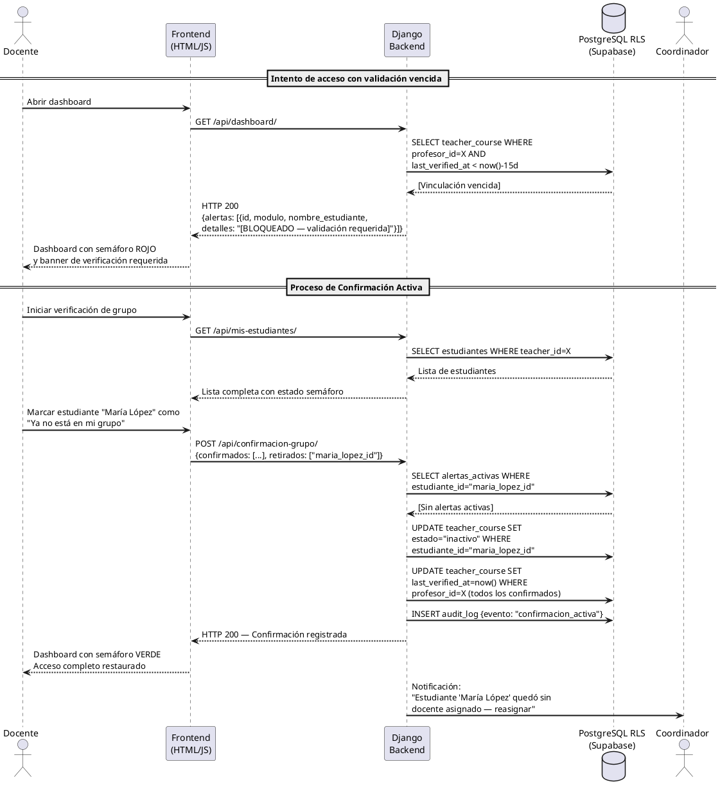

# 07 — Diagramas UML: Alerta Temprana 360

**Herramienta recomendada:** [PlantUML Online](https://www.plantuml.com/plantuml/uml) · Draw.io (importar como PlantUML)  
**Versión:** 1.0 · **Fecha:** 2026-04-30  
**Trazabilidad:** Los casos de uso derivan de las HUs del documento `06_historias_usuario.md`.

---

## 1. Diagrama de Casos de Uso — Sistema Completo

---

## 2. Diagrama de Secuencia 1 — Registro y Escalamiento de Alerta Crítica

**Escenario:** Docente registra una alerta de "Conducta Suicida". El sistema hace triage, notifica al Coordinador y Psicólogo. Si el Coordinador no atiende en 24h, escala al Rector.

---

## 3. Diagrama de Secuencia 2 — Vinculación de Padre por OTP y Revocación

**Escenario:** La institución genera un OTP para el acudiente. El Padre se registra. Posteriormente el Coordinador revoca el acceso.

---

## 4. Diagrama de Secuencia 3 — Confirmación Activa de Grupo y Bloqueo RLS

**Escenario:** Han pasado 15 días sin confirmación. El Docente intenta ver detalles, el RLS los bloquea. El Docente confirma y recupera el acceso. Un estudiante fue transferido — se activa Hand-off.

---

## Notas de implementación

- **Herramienta recomendada** para el diagrama de casos de uso: Draw.io con importación PlantUML o [diagrams.net](https://diagrams.net).
- **Herramienta recomendada** para los diagramas de secuencia: [PlantUML Online Editor](https://www.plantuml.com/plantuml/uml) — copiar el código de cada bloque y renderizar.
- Los diagramas de secuencia usan la notación estándar UML 2.5 con `alt`, `loop` y `note` de PlantUML para mayor claridad.
- Los nombres de los endpoints (`/api/alertas/`, `/api/vinculos/`) son orientativos — la implementación en Django REST Framework puede variar en la versión final.

---

*Documento preparado por el equipo Alerta Temprana 360.*  
*Versión 1.0 — Se actualiza con cada Sprint que modifique flujos principales.*
